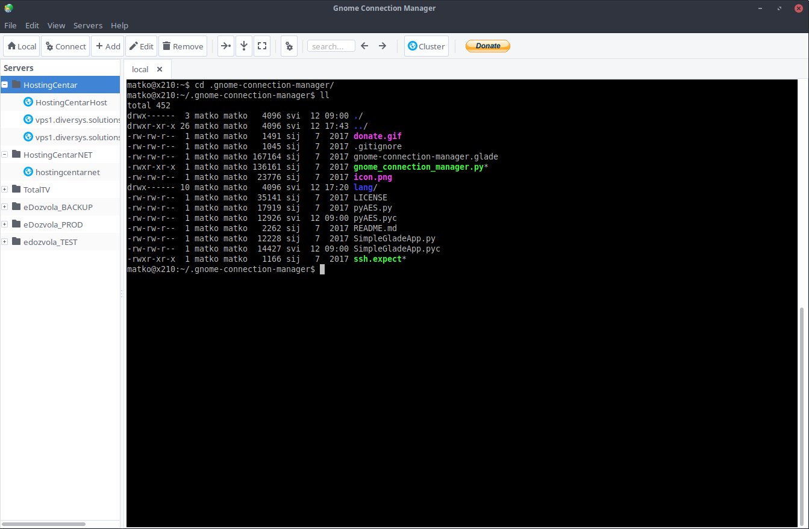

# Gnome Connection Manager

Gnome Connection Manager was adapted from Python 2 to Python 3 to make posible it works on modern Python 3 based Linux Distributions like Debian 10, Linux MX 19, Manjaro, Arch Linux, etc. 



Tabbed SSH connection manager for modern GTK+ environments.

- Gnome Connection Manager is licensed under the GNU General Public License version 3
- It's designed in Glade and written in python 3, so it just needs PyGObjects to run in any linux environment
- Can store passwords securely for easy access to hosts
- Supports multiple ssh tunnels for each host
- Unlimited vertical/horizontal window splitting. You can have as many visible consoles as you want
- Drag&Drop tabs between consoles
- Connect to multiple hosts with just one click
- Grouping hosts
- Cluster mode. Work on several hosts at the same time
- Customizable shortcuts
- Send custom commands to hosts

## Dependencies
Make sure you have installed the following packages (Ubuntu):

- python3-gi (>= 3.0)
- expect
- pycrypto

On Ubuntu and Debian you can install them with the following one-liner:

```shell
sudo apt-get install python3-gi python3-crypto expect python3-gi-cairo gir1.2-gtk-3.0
```

## Installing
Once you have dependencies installed, you need to clone this repository. Locate a directory where you wanto to install Gnome Connection Manager and run this command on the terminal:

```shell
git clone https://github.com/larmedina75/gnome-connection-manager.git
```

Go to the gnome-connection-manager directory and type this command in shell:

```shell
python gnome_connection_manager.py
```

The application will read your `LANG` environment variable and load appropriate translation file (if your language is 
supported), otherwise it will fallback to english.

If you want to start gnome-connection-manager with specific language start it with LANGUAGE parameter followed by language code, 
like so:

```shell
LANGUAGE=de_DE python gnome_connection_manager.py
```

If you want to run the application from menu/launcher you can create .desktop file in your 
/home/USERNAME/.local/share/applications directory. Assuming you placed gnome-connection-manager source in directory
/home/USERNAME/.gnome-connection-manager/ your .desktop file could look like this:

```text
[Desktop Entry]
Version=1.0
Encoding=UTF-8
Name=Gnome Connection Manager
Comment=A simple ssh connection manager for gnome
GenericName=Connection Manager
Exec=/home/USERNAME/.gnome-connection-manager/gnome_connection_manager.py
Terminal=false
Type=Application
Icon=/home/USERNAME/.gnome-connection-manager/icon.png
Categories=GTK;GNOME;Network;
```

Replace USERNAME in examples above with your username.

# Note about the author
The original author of GCM is Renzo Bertuzzi (kuthulu@gmail.com), this works is a fork from GCM implementation by matko.jun@gmail.com
and ported from Python 2 (pyGtk, python-vte) to Python 3 and PyGObjects (GTK+3, GDK 2.6, Vte 2.91) by Luis Armando Medina Avitia (lamedina@gmail.com)
